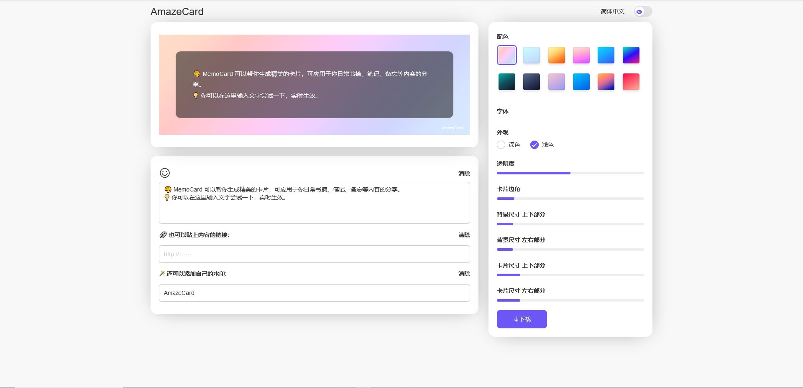
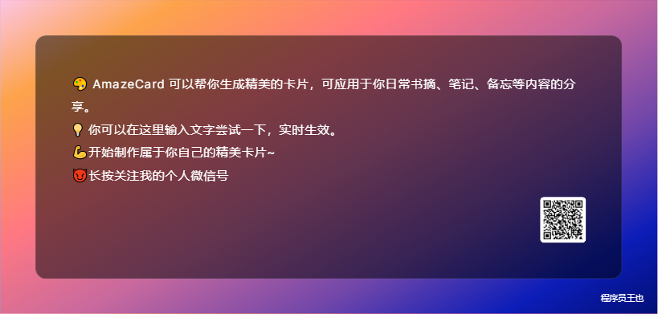

# AmazeCard

## 语言选择

- [中文](./README.md)
- [英文](./README.EN.md)

## 在线访问

https://card.wudiguang.top/

## 私有化部署

一键免费部署你的私人`AmazeCard`

[演示 Demo](https://amaze-card-git-master-wudgs-projects.vercel.app/) / [反馈 Issues](https://github.com/wudg/AmazeCard/issues)

## 关于

AmazeCard是一个在线工具，可以将文字和表情符号转换为图片。它可以自定义生成图像的颜色和卡片样式，以及自定义水印（文本或logo），还可以在生成的图像中放置链接并形成相应的二维码。

**网站显示如下图**

**生成的卡片示意图如下**

## 功能

基于文本和表情符号生成精美图片

## Advantage

1. 🎈自定义专属水印/logo
2. 🎃丰富的表情符号图案
3. 👓实时渲染效果
4. 🎨定制各种卡片样式
5. 🕹可以根据提供的链接在图像中生成相应的二维码

## 联系我

## 需求版本

1. 滑条体验升级(已上线)
2. 图片复制到剪切板(已上线)
3. 卡片支持自定义logo（替代文本水印或者额外增加logo）
4. 站点添加开发团队微信号/二维码
5. 移动端适配
6. 输入框表情图案分类展示

## 功能迭代

### V1.0.1 2024-01-24 20:25

1. 添加复制成图片功能
2. 修改滑块的操作范围

### V1.0.2 2024-01-25 21:20

1. 添加选择字体功能
2. 卡片支持自定义logo（替代文本水印或者额外增加logo）

### V1.0.3 2024-01-26 16:50

1. 适配移动端

### V1.0.4 2024-01-31 21:11

1. 适配移动端优化

### V1.0.5 2024-03-26 22:30
1. 添加富文本编辑功能
2. 删除表情

### V1.0.6 2024-04-02 22:53
1. 添加跳转到GitHub
2. 添加微信二维码

### V1.0.7 2024-04-13 22:00
1. 修改bug

### V1.0.8 2024-06-22 21:31
1. 添加自定义尺寸和选择预设尺寸